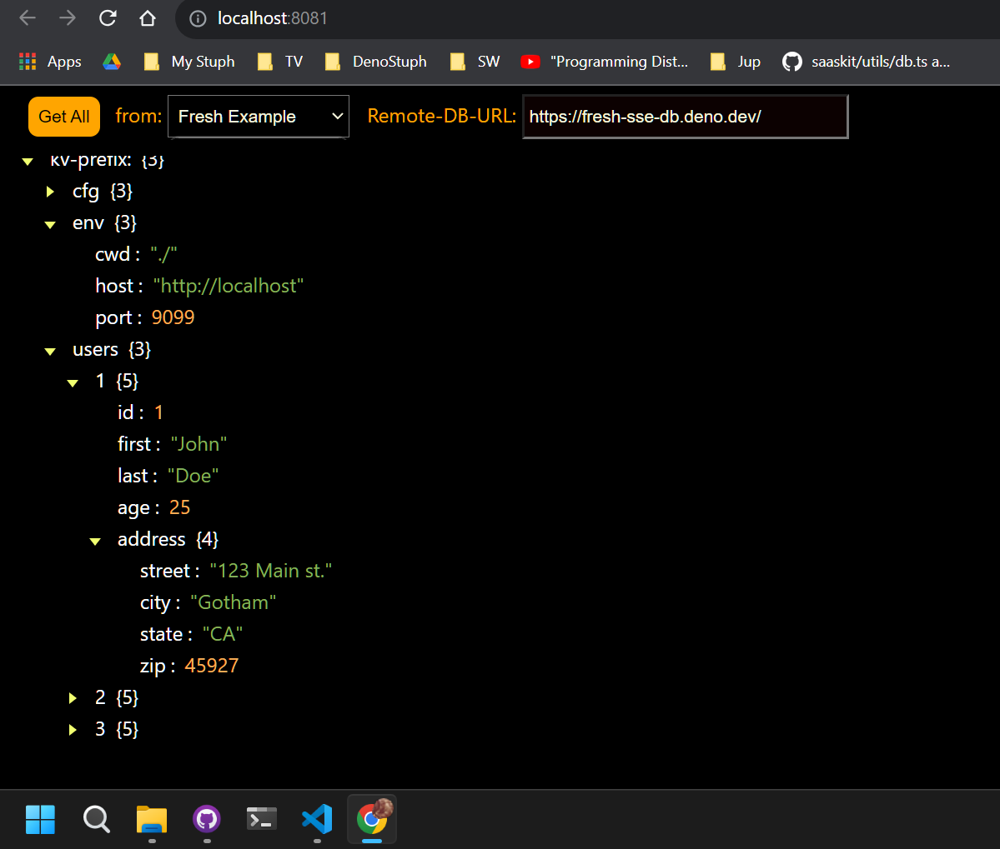
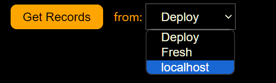
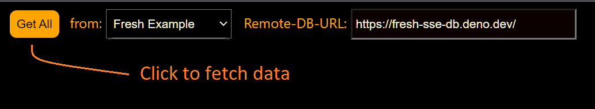

# Kv-Viewer
This is an example application for examining DenoKv data in a TreeView.     
This app uses a simple SSE-RPC service to fetch all DenoKv-db-rows.    
KvKeys are deconstructed for viewing in a DOM Treeview.    
The **SSE-RPC** api must be implemented in the donor DB app.

This example defaults to a Deno **Deploy** test db donor.    
DB-Donor code: https://github.com/nhrones/KvRPC    

You may want to try the Deno-Fresh-Deploy impl by selecting **Fresh**.    
DB-Donor code: https://github.com/nhrones/Fresh-SSE-DB       
You'll find the required SSE-RPC code is in /routes/SSERPC/ folder   

 

## Note:
You can enter any URL that has implemented the minimal SSE-RPC api.   

## SSE-RPC
This simple SSE-RPC service is easy to use.    
  - A DB-Donor simply needs to implement the SSE-RPC API    
  - Any client that implements the required client-code (see ./dbClient.js), can access any Donor-DB
  - By design, any donor-db can support multiple clients.     

SEE: https://github.com/nhrones/KvRPC/blob/main/README.md

## WARNING: 
This is an unfinished work that was used to test the concept of showing multipart-keys in a tree format.  Many features are yet to be implemented. This work has now been rolled into another db project that has full remote **CRUD** plus the ability to use many peristence layers. 

This simple client demonstrates a minimal transaction-based SSE-RPC service.   

# Try it now!
First, launch the Treeview Client from Github-Pages          
https://nhrones.github.io/KvRPC_TreeClient/    

Select a DB source. (note: localhost requires starting a local test server)    

Next, click the **Get All** button.    

    

Now, click the root node \<kv-prefix:\> to expand the tree

