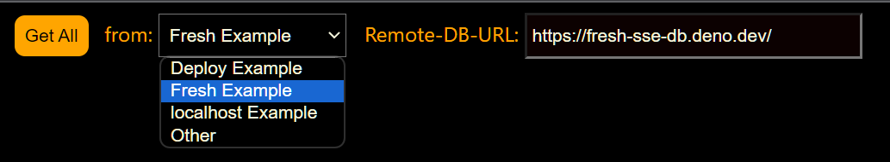

# KvDb-Remote-Viewer
This is an example application for examining remote DenoKv data in a TreeView.     
This app uses a simple SSE-RPC service to fetch all remote-db-rows.    
KvKeys are then deconstructed for viewing in a DOM Treeview.    
The **SSE-RPC** api must be implemented in the remote donor app.

This example defaults to a remote Deno **Deploy Example** test donor.    
DB-Donor code: https://github.com/nhrones/KvRPC    

You may want to try the Deno-Fresh-Deploy implementaion by selecting the **Fresh Example**.    
DB-Donor code: https://github.com/nhrones/Fresh-SSE-DB       
You'll find the required SSE-RPC code in the apps ./routes/SSERPC/ folder.   

<br/>


## Note:
You can select a remote db from the **_From_** dropdown.    
Select **Other**, to allow entering any URL that implements the SSE-RPC api.   

## SSE-RPC
This simple SSE-RPC service is easy to use.    
  - A DB-Donor simply needs to implement the SSE-RPC API    
  - Any client that implements the required client-code (see ./dbClient.js), can access any Donor-DB
  - By design, any donor-db can support multiple concurrent clients.     

SEE: https://github.com/nhrones/KvRPC/blob/main/README.md


## WARNING: 
This is an unfinished work that was used to test the concept of showing multipart-keys in a tree format.  Many features are yet to be implemented. This work has now been rolled into another db project that has full remote **CRUD** plus the ability to use many peristence layers. 

This simple client demonstrates a minimal transaction-based SSE-RPC service.   

# Try it now!
First, launch the Treeview Client from Github-Pages          
https://nhrones.github.io/KvRPC_TreeClient/    

Select a DB source. (note: localhost requires starting a local test server)    
 


Next, click the **Get All** button.    

    

## The example dataset:
The included data in the example apps was built with the following Deno commands:
```ts
   await db.set(["env", "host"], "http://localhost")
   await db.set(["env", "port"], 9099)
   await db.set(["cfg", "target"], "./dist")
   await db.set(["cfg", "include"], "./src")
   await db.set(["cfg", "options"], { debug: true, useKv: true, dbFile: "./data/db.db" })
   await db.set(["users", 1], { id: 1, first: "John", last: "Doe", age: 25, address: { street: '123 Main st.', city: 'Gotham', state: "CA", zip: 45927 } })
   await db.set(["users", 2], { id: 2, first: "Jim", last: "Smith", age: 35, address: { street: '456 A st.', city: 'Fremont', state: "CA", zip: 45938 } })
   await db.set(["users", 3], { id: 3, first: "Joe", last: "Smoe", age: 45, address: { street: '789 B st.', city: 'Hayward', state: "CA", zip: 45941 } })

```
